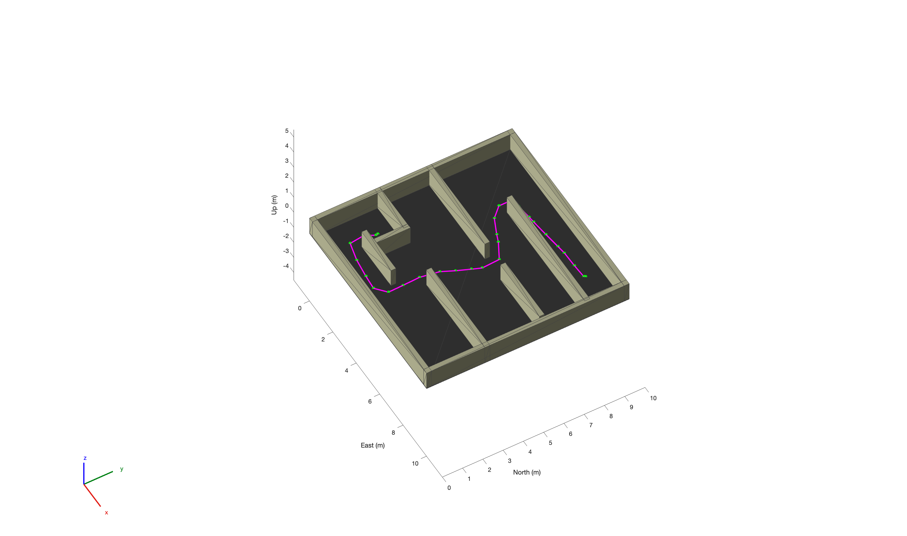

# Path_Planner_AStar MATLAB Script

## Overview
This repository demonstrates path planning using the A* algorithm for a mobile robot navigating through a maze-like environment. The code generates a scenario with walls and obstacles, plans a path from a specified start position to a goal position, and simulates the robot's movement along the planned path.

## Requirements
- MATLAB R2019a or later
- MATLAB Robotics System Toolbox

## Usage
1. Open MATLAB.
2. Set the current directory to the location of the script.
3. Run the script `Path_Planner_AStar.m`.

## Script Description
1. Define the scenario with a floor and walls.
2. Create a binary occupancy map from the scenario.
3. Plan a path using the A* algorithm from a specified start position to a goal position.
4. Generate a trajectory for the robot to follow based on the planned path.
5. Load a robot model and create a platform for the robot.
6. Visualize the scenario, planned path, and robot movement in a 3D environment.
7. Simulate the robot's movement along the planned path.

## A* Algorithm Description
The A* algorithm used in this script works as follows:
1. **Initialization**:
   - Start with an initial node representing the starting position.
   - Create an open list to store nodes to be evaluated and a closed list to store nodes that have already been evaluated.
   - Initialize the cost of the starting node as 0 and the heuristic cost (estimated cost to reach the goal from the current node) as the Euclidean distance from the starting node to the goal node.
2. **Expansion**:
   - Repeat the following steps until either the goal node is reached or there are no more nodes to evaluate:
     - Select the node from the open list with the lowest total cost (sum of the actual cost from the starting node to the current node and the heuristic cost).
     - Remove the selected node from the open list and add it to the closed list.
     - Generate neighboring nodes of the selected node.
     - For each neighboring node:
       - If the neighboring node is not walkable or is in the closed list, skip it.
       - If the neighboring node is not in the open list, compute its actual cost and heuristic cost, and add it to the open list.
       - If the neighboring node is already in the open list, update its cost if the new cost is lower than the previous cost.
3. **Backtracking**:
   - Once the goal node is reached, trace back the path from the goal node to the starting node by following the parent pointers stored in each node.
   - Construct the optimal path by concatenating the nodes from the starting node to the goal node.
4. **Path Output**:
   - Output the optimal path generated by the A* algorithm, which represents the sequence of nodes (grid cells) to traverse from the starting position to the goal position.

## Customize
- Modify the maze layout, wall positions, and colors by adjusting the variables `wallPositions`, `wallSizes`, and `wallColor`.
- Change the start and goal positions by updating the variables `startPosition` and `goalPosition`.
- Adjust the robot's height and trajectory parameters as needed.

## Result

## Notes
- Ensure that the start position is not inside any obstacles to avoid errors during path planning.
